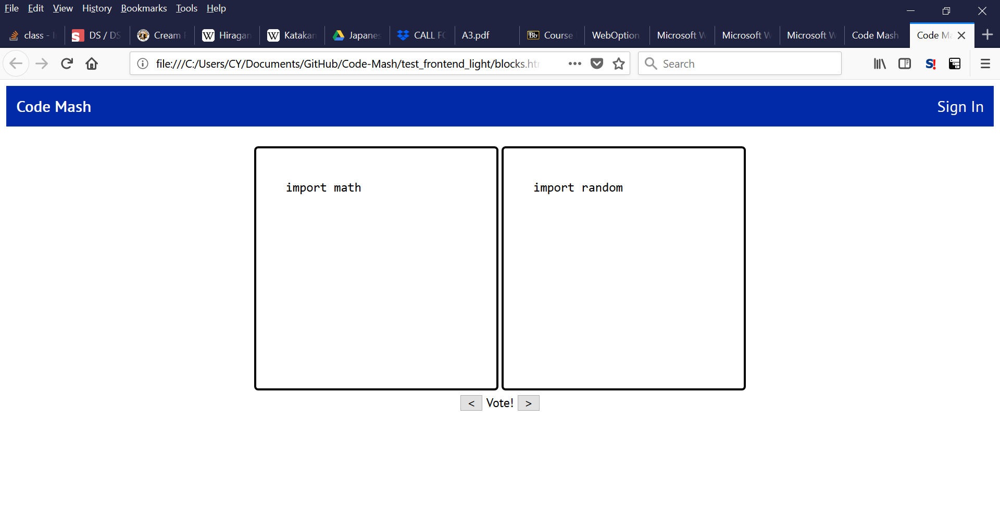
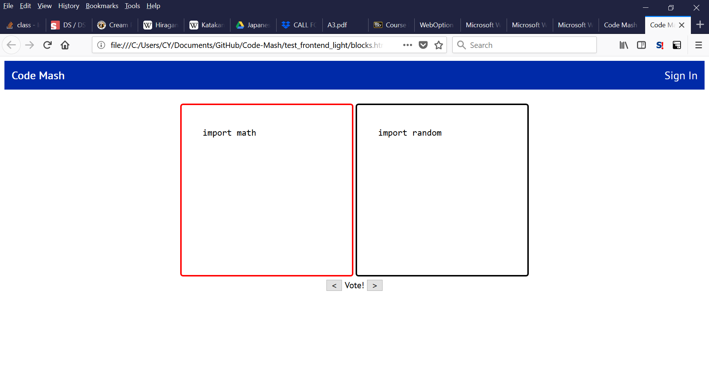
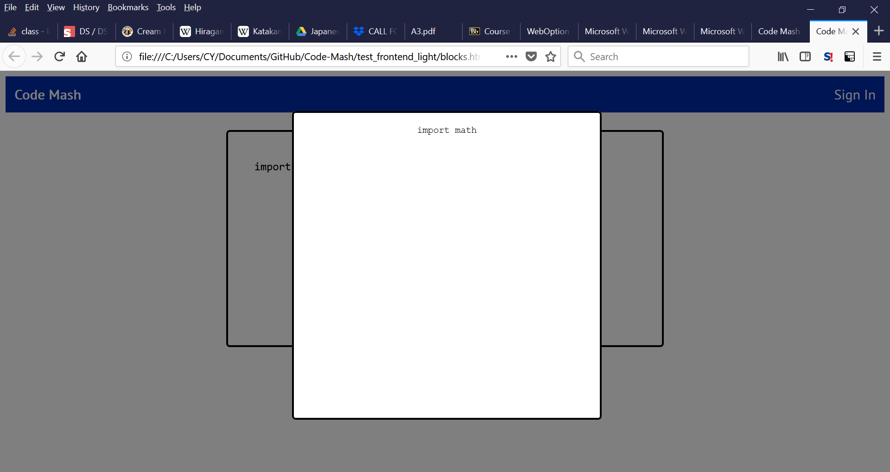

# Code-Mash
"Would you rather" game but for code

We will be using Flask for Back-end implementation and AngularJS for front-end

*Some screenshots of amazing progress*

New CSS.

These two just to show that when you click a block, its corresponding text appears. This overlay block is clearly not yet formatted properly but I'll get to that.